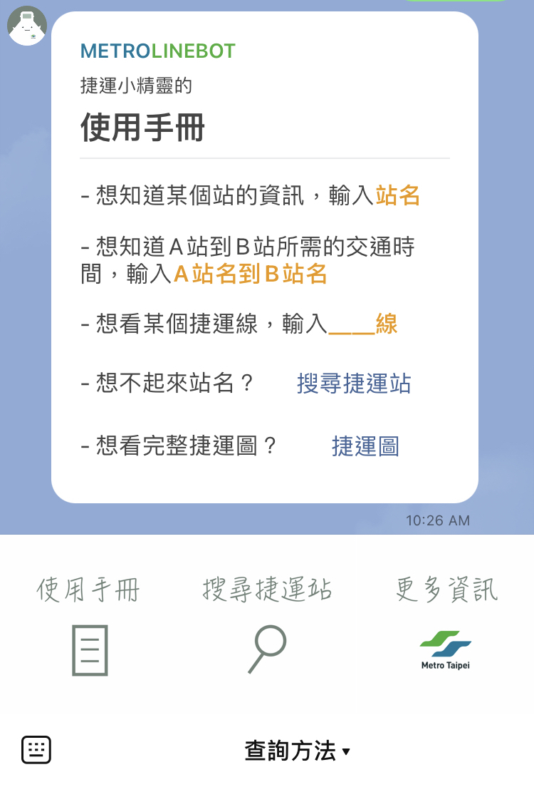
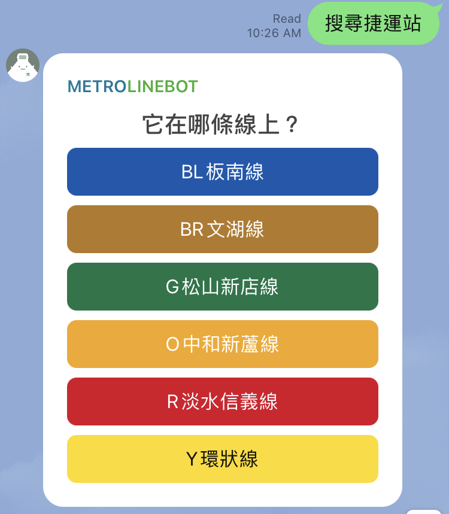
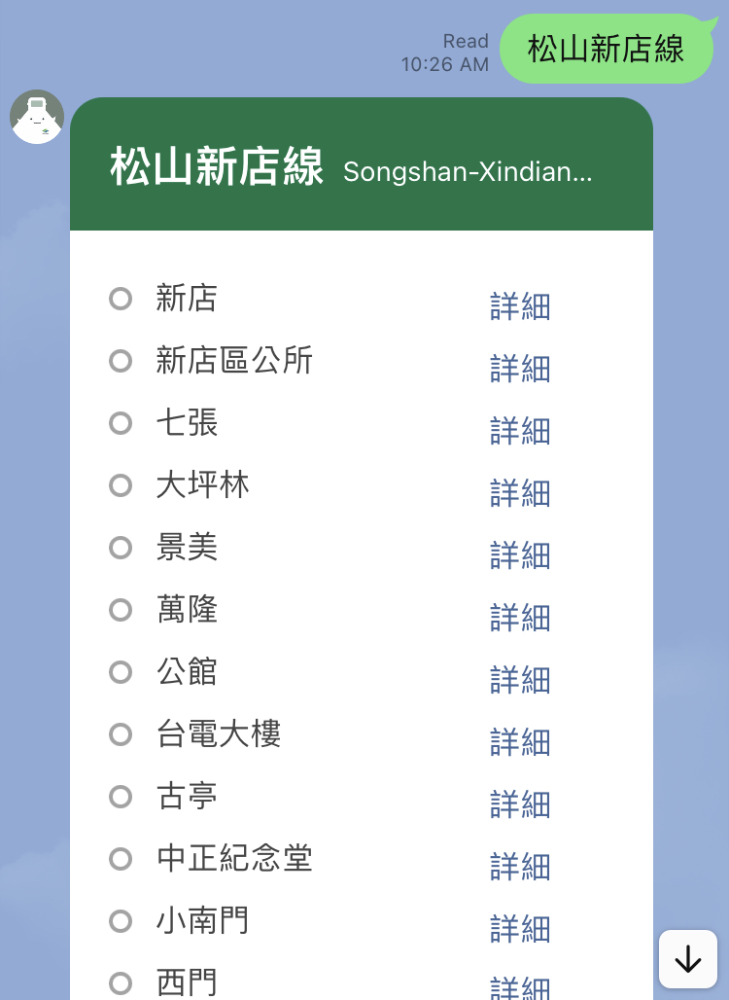
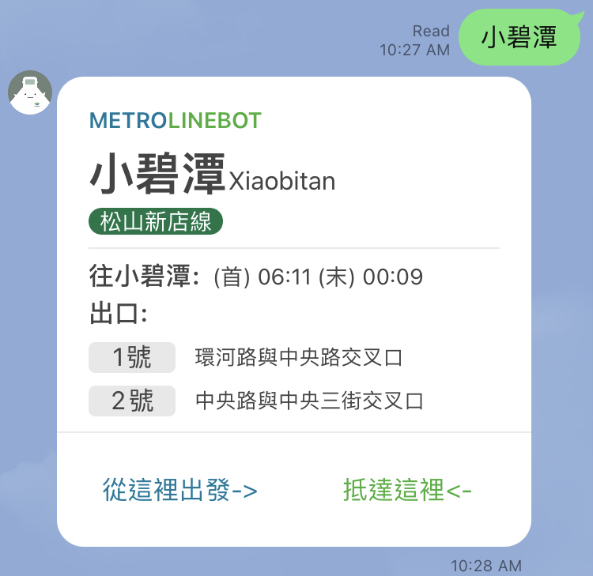

## metro_linebot (捷運小精靈)

這是一個我用來熟悉line API 的小project，一個可以用來查詢捷運相關資訊的Line 聊天機器人，使用PTX(公共運輸整合資訊流通服務平臺) API的資料。

|  |  |  |
| :---------------------------------------------------------: | ------------------------------------------------------------ | :---------------------------------------------------------: |

|  |  |
| :---------------------------------------------------------: | :----------------------------------------------------------: |

- #### 聊天機器人連結:

  

- #### 服務簡介

  包含以下功能（僅包含台北捷運）：

  - 提供捷運圖
  - 線路列表
  - 單一線路站點列表
  - 站點查詢：所在線路、首末班車、出口位置
  - 站到站查詢：票價、路線規劃  **(注意：路線規劃的轉乘功能尚未完成)**

- #### 使用技術
  - PTX(公共運輸整合資訊流通服務平臺) API
  - Line messaging API, line-bot-sdk-nodejs
  - nodeJS, express, axios
  - heroku

